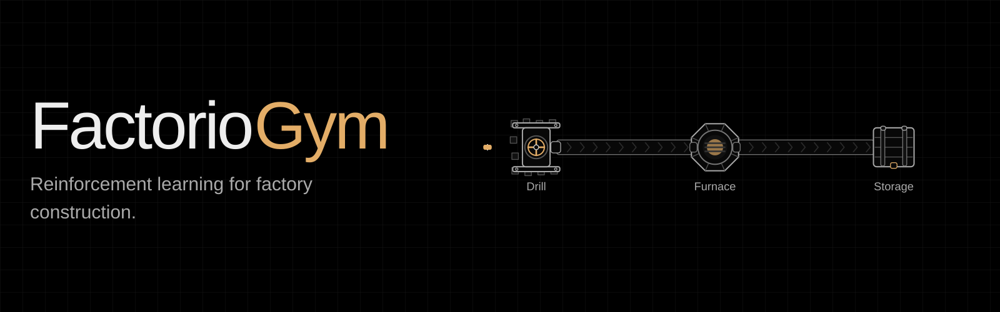

<p align="center">
  
</p>

FactorioGym is an environment for training and evaluating agents in Factorio.
It gives you a Gymnasium interface, typed game actions, isolated headless
workers, and tasks scored on factory production. Agents walk, mine, build,
and supply machines in the game.

Train PPO policies against the engine, evaluate policies from the companion C11
simulator, or connect a language-model agent. Reported simulator-trained
policies reach **90.6% success in Factorio** on held-out layouts for two
construction tasks.

[Results](#results) · [RL implementation](#rl-implementation) · [Quick start](#quick-start) · [Architecture](#architecture) · [Documentation](docs/README.md)

## Results

The following results use policies trained entirely in the simulator.
Structural holdouts change the layout family, for example by placing an ore
patch behind a wall or adding an obstacle the character must navigate around.

| Task | Simulator held-out success | Factorio held-out success |
|---|---|---|
| `construct_smelting_line` | 86.8% (4 seeds) | 90.6% |
| `build_line` | 94.9% (3 seeds) | 90.6% |
| `plate_line` | 98.2%, 100%, 99.0% (3 seeds) | Not reported |

The simulator and engine columns represent separate evaluations. Seed counts
shown in the simulator column do not describe the engine evaluation. The
committed [M5 transfer report](docs/evidence/sim-transfer-m5.json) records a
32-episode held-out engine evaluation, including scene details and policy
metadata. See [known limitations](docs/LIMITATIONS.md) for evaluation caveats
and results from earlier action spaces.

The experiments also compare action parameterization and curriculum design.
Both comparisons below used four seeds per arm.

| Change | Observed effect |
|---|---|
| Condition target, item, and amount on preceding choices | Held-out success rose from 60.0% to 86.8%; the range across seeds fell from 51 to 10 percentage points |
| Advance the reverse curriculum after solving its deepest demonstration cut | Failed runs fell from 3 of 4 with a fixed schedule to 0 of 4 |

For comparisons on identical scenes,
[`freeze_holdout.py`](tools/freeze_holdout.py) generates a fixed evaluation
set, hashes its scenes, and checks for drift by regenerating them from source.
The [frozen holdout](docs/evidence/holdout_v3.json) must be passed explicitly
to training commands that use it. A fixed training seed alone does not fix
the evaluation scenes.

## Features

| Component | Function |
|---|---|
| Gymnasium interface | Structured observations, parameterized actions, and action masks for RL policies |
| PPO training | MaskablePPO with a spatial CNN, entity encoder, and duration-aware advantage estimation |
| Game integration | A Lua mod and typed RCON protocol for controlling headless Factorio |
| Parallel workers | Isolated saves, ports, and logs with supervised process cleanup |
| Task framework | Layout families, reward definitions, success predicates, and train/test splits |
| Evaluation tools | Frozen scene sets, random-policy baselines, and checkpoint compatibility checks |
| Agent interface | Optional language-model integration with spending limits and HTML replays |
| Simulator transfer | Evaluate exported policies from the separate C11 simulator in the game engine |

**Status: alpha.** Windows is the tested platform. Engine tasks require
Factorio 2.0.60, build 83512. The test suite runs without the game.

| Start here | Guide |
|---|---|
| Train your first policy | [Quick start](#quick-start) and [learning recipe](docs/RECIPE.md) |
| Add a task | [Task authoring](docs/AUTHORING_TASKS.md) |
| Connect a language model | [Agent guide](docs/AGENT.md) |
| Inspect the implementation | [Architecture](#architecture) and [design contracts](docs/DESIGN.md) |

## RL implementation

The engine trainer uses **MaskablePPO** from `sb3-contrib`, with a custom
PyTorch feature extractor and separate policy and value heads. Observations
combine a local spatial grid, nearby entities, inventory, character state,
and task goals.

| Part | Implementation |
|---|---|
| Spatial encoder | Three strided convolutions with 16, 32, and 64 channels; 4×4 adaptive pooling preserves coarse spatial layout |
| Entity encoder | Shared MLP per entity, followed by masked mean and max pooling |
| State encoder | MLP over inventory, character state, and goal vectors |
| Actor and critic | Encodings fused into 256 features, with separate 256-unit policy and value hidden layers |
| Action space | Task-dependent discrete catalogs or parameterized `MultiDiscrete` actions for operation, target, placement, direction, item, and amount |
| Action masks | Restrict sampling using the current action contract; parameterized masks apply per dimension |
| Temporal abstraction | Optional skills span multiple primitive steps; the rollout buffer discounts by `gamma^k` and adjusts GAE for action duration `k` |
| Rewards | Task success and step costs, with optional potential-based or high-water progress shaping; high-water shaping does not guarantee policy invariance |

Default engine-training settings are a learning rate of `3e-4`, a minibatch
size of `128`, an entropy coefficient of `0.01`, and `gamma = 0.99` unless the
task specifies its own discount. The rollout budget is `512` decisions,
divided across workers subject to a minimum per-worker rollout length.

The simulator experiments use a separate training implementation. Their
conditional action sampling chooses arguments based on earlier choices;
the stock SB3 parameterized distribution samples dimensions independently.
Exported simulator policies run through a TorchScript adapter against the
matching observation and action profiles in Factorio. The PPO defaults above
describe the engine trainer, not the simulator experiments in the results table.

Source: [trainer](src/factoriorl/learn/train.py),
[policy network](src/factoriorl/learn/policy.py),
[rollout buffer](src/factoriorl/learn/buffers.py), and
[simulator policy adapter](src/factoriorl/learn/sim_policy.py).

## Quick start

| Requirement | Version / availability |
|---|---|
| Platform | Windows tested; other platforms untested |
| Python | 3.11+ |
| Package manager | [uv](https://docs.astral.sh/uv/) |
| Factorio | 2.0.60, build 83512; headless is sufficient |
| Installation | Source checkout; checkpoints are not bundled |

### Run tests without Factorio

```powershell
uv sync
uv run pytest tests/unit tests/contract -q
```

These tests cover the protocol, task engine, encoders, rewards, action
contracts, and frozen-holdout tooling. Engine tests skip when Factorio is
unavailable; use `--require-engine` when an engine run is required.

### Configure the game

The environment requires **Factorio 2.0.60, build 83512**. Other builds are
rejected because the action and observation contracts depend on this build's
prototypes. Obtain it from the [Factorio release archive](https://factorio.com/download/archive/).
The headless build is sufficient.

Set the executable path in PowerShell:

```powershell
$env:FACTORIO_RL_ENGINE = "C:\path\to\factorio\bin\x64\factorio.exe"
```

Alternatively, copy [`.factoriorl.user.json.example`](.factoriorl.user.json.example)
to `.factoriorl.user.json` and edit the path. Discovery checks the environment
variable, the local configuration file, then the built-in default, using the
first path that exists.

```powershell
uv sync --extra rl --group train
uv run factoriorl doctor
uv run factoriorl doctor-train
```

The diagnostic commands check the game build and training setup. Choose the
dependency set for your use case:

| Install | Includes |
|---|---|
| `uv sync` | Base package and development tools; enough for unit and contract tests |
| `uv sync --extra rl` | NumPy and Gymnasium for environment use |
| `uv sync --extra rl --group train` | Training stack, including CUDA PyTorch |

### Run a first training experiment

The following command trains a `deliver` policy directly against the engine.
It is a small starting experiment, separate from the simulator-trained
construction results above. The [learning recipe](docs/RECIPE.md) documents
expected results, runtime, and measured random baselines.

```powershell
uv run factoriorl train --task deliver --steps 25000 --skills --holdout docs/evidence/holdout_v3.json --eval-episodes 100
```

Evaluate a saved run:

```powershell
uv run factoriorl evaluate --checkpoint <run_id> --episodes 100
```

Evaluation loads the task and action space from the run manifest, checks
checkpoint compatibility, and reports a random-policy baseline alongside the
success rate. It requires no API key or network access.

Checkpoints are not distributed with this repository. `runtime/` and
`release/` are gitignored. The C11 simulator is maintained separately;
[`sim_transfer.py`](tools/sim_transfer.py) evaluates its exported policies
in this environment.

To extend the environment, see [task authoring](docs/AUTHORING_TASKS.md).
The optional [language-model interface](docs/AGENT.md) supports provider
integration, spending limits, and replay inspection.

## Performance

Reported measurements from the project's benchmark runs:

| Measurement | Result |
|---|---|
| RCON round trip | 16.7 ms |
| Engine step, one worker | 24.0 ms / 41.6 steps per second |
| Engine, 8 workers | 261 decisions per second |
| Separate C11 simulator, 16 CPU threads | 947,000 decisions per second |
| Reset | 6.2 ms |
| Observation size | 1.1 to 5.3 KB |

The reported simulator throughput is approximately 3,600 times the
eight-worker engine throughput. These measurements depend on the hardware,
worker count, and workload; see [throughput limitations](docs/LIMITATIONS.md#9-throughput).

## Architecture

Python controls headless Factorio workers over RCON. A Lua mod handles game
interaction, stepping, observations, and entity handles through a typed
protocol. Policies consume structured state through the Gymnasium interface.

| Component | Responsibility |
|---|---|
| [`mod/factoriorl/`](mod/factoriorl/) | Game-side actions, observations, and stepping |
| [`src/factoriorl/`](src/factoriorl/) | Worker lifecycle, transport, sessions, environment, and training |
| [`tasks/spec.py`](src/factoriorl/tasks/spec.py) | Task predicates, rewards, layout families, and splits |
| [`parameterized.py`](src/factoriorl/parameterized.py) | `MultiDiscrete` action space and per-dimension masks |
| [`encoders.py`](src/factoriorl/encoders.py) | State encoding and observation ordering |
| [`pool.py`](src/factoriorl/pool.py) | Worker orchestration and process cleanup |
| [`tests/contract/`](tests/contract/) | Action and observation contract checks |

Each worker runs under `runtime/workers/<id>/` with its own save, mod directory,
ports, and logs. Port reservations prevent conflicts between processes. The
user's Factorio profile stays untouched, and a Windows job object cleans up
child engines when the parent exits.

Game-side actions include guards for engine edge cases, such as overlapping
drills accepted by placement checks. The
[reproduction probe](tools/probe_duplicate_drill.py) and
[action implementation](mod/factoriorl/actions.lua) document that case.

The [design document](docs/DESIGN.md) specifies the implementation contracts.

## Command reference

| Command | Purpose |
|---|---|
| `uv run factoriorl doctor` | Check the engine path and pinned build |
| `uv run factoriorl doctor-train` | Check PyTorch, CUDA, and GPU availability |
| `uv run factoriorl doctor-agent` | Check the model provider connection |
| `uv run factoriorl worker start` | Launch a supervised worker |
| `uv run factoriorl worker reap` | Terminate orphaned engines |
| `uv run factoriorl tasks list` | List available tasks |
| `uv run factoriorl tasks validate` | Validate task definitions |
| `uv run factoriorl runs list` | List recorded runs |
| `uv run factoriorl replay <run_dir>` | Generate an HTML replay for a language-model agent run |
| `uv run factoriorl bench transport` | Measure transport latency |
| `uv run factoriorl action-matrix` | Regenerate the action reference |

## Scope and limitations

| Area | Current limit |
|---|---|
| Task scope | Small production systems; no demonstrated end-to-end construction-and-recovery run |
| Learning results | Strongest construction results use simulator training; the earlier three-family 80% engine-training target remains unmet |
| Baselines | Some tasks have high random success with skills enabled; compare results within the same action space |
| Distribution | Simulator maintained separately; no pretrained checkpoints bundled |
| Rendering | Headless runs do not produce game screenshots |

See [known limitations](docs/LIMITATIONS.md) for evaluation caveats and the
supporting measurements.

## License

[Apache-2.0](LICENSE). Factorio is a game and trademark of Wube Software Ltd.
This project is independent and is not affiliated with or endorsed by Wube.
No game files are included. Running engine tasks requires your own copy of
Factorio or Wube's headless server. See [NOTICE](NOTICE).
